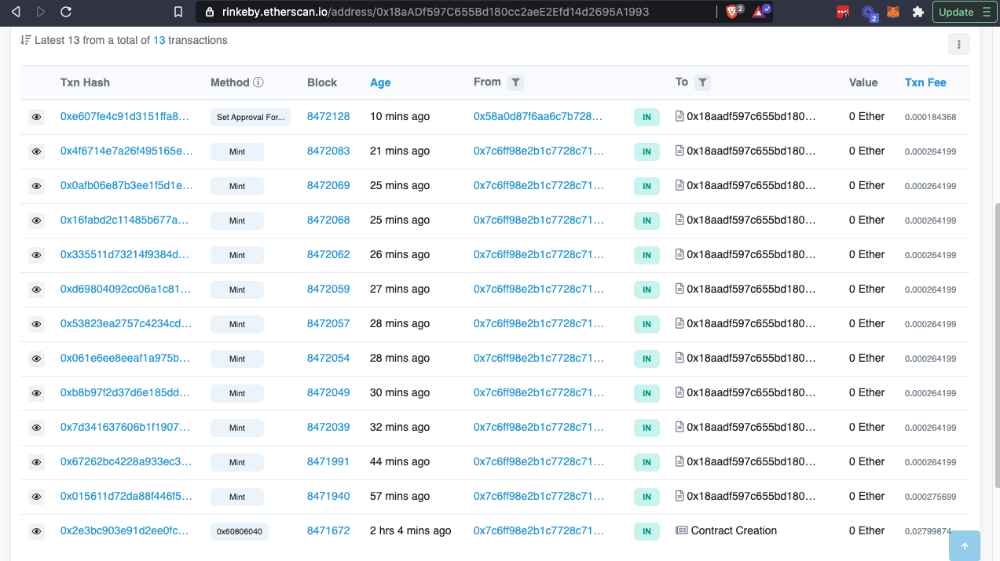

# Udacity Blockchain Capstone

The capstone will build upon the knowledge you have gained in the course in order to build a decentralized housing product. 

Install
To install, download or clone this repo, then:

npm install npm install --save @truffle/hdwallet-provider@1.2.3

Start Ganache desktop client  

In a separate terminal window,from inside the directory eth-contracts/ Compile smart contracts: cd eth-contracts/ truffle compile

Testing
To run truffle tests: In directory eth-contracts/ cd eth-contracts/

truffle test test/TestERC721Mintable.js truffle test test/TestSquareVerifier.js truffle test test/TestSolnSquareVerifier.js

For all tests: truffle test (All 11 tests should pass. For single file tests)

 Contract: TestERC721Mintable
    match erc721 spec
      ✓ should return total supply (54ms)
      ✓ should get token balance (69ms)
      ✓ should return token uri (68ms)
      ✓ should transfer token from one owner to another (251ms)
    have ownership properties
      ✓ should fail when minting when address is not contract owner (465ms)
      ✓ should return contract owner (79ms)
    Able to transfer tokens
      ✓ Able to approve an operator for all tokens transfer (210ms)
      ✓ Operator is able to transfer a token (635ms)

  8 passing (11s)

 Contract: verifier
    Test if a new solution can be added for contract - SolnSquareVerifier
      ✓ add new solution (1798ms)
    Test if an ERC721 token can be minted for contract - SolnSquareVerifier
      ✓ MintERC721 (1441ms)

  2 passing (5s)

  Contract: verifierTest
    Test verification with correct proof
      ✓ correct proof (1129ms)
    Test verification with incorrect proof
      ✓ incorrect proof (1092ms)

  2 passing (3s)

Rinkeby Deployment info
1 Login/create infura account to obtain Rinkeby endpoint Update the truffle-config.js file to include the Rinkeby network truffle compile truffle migrate --network rinkeby --reset

Rinkeby Deployment output:
Compiling your contracts...
Everything is up to date, there is nothing to compile.

Compiling your contracts...
===========================
> Everything is up to date, there is nothing to compile.

Migrations dry-run (simulation)
===============================
> Network name:    'rinkeby-fork'
> Network id:      4
> Block gas limit: 10000000 (0x989680)

1_initial_migration.js
======================

   Replacing 'Migrations'
   ----------------------
   > block number:        8471661
   > block timestamp:     1619309359
   > account:             0x7c6ff98e2B1c7728c7196417345029140b1D98cd
   > balance:             14.56239379
   > gas used:            210237 (0x3353d)
   > gas price:           10 gwei
   > value sent:          0 ETH
   > total cost:          0.00210237 ETH

   -------------------------------------
   > Total cost:          0.00210237 ETH

2_deploy_contracts.js
=====================

   Deploying 'MyERC721PropertyToken'
   ---------------------------------
   > block number:        8471663
   > block timestamp:     1619309397
   > account:             0x7c6ff98e2B1c7728c7196417345029140b1D98cd
   > balance:             14.53574642
   > gas used:            2637374 (0x283e3e)
   > gas price:           10 gwei
   > value sent:          0 ETH
   > total cost:          0.02637374 ETH

   Replacing 'Verifier'
   --------------------
   > block number:        8471664
   > block timestamp:     1619309415
   > account:             0x7c6ff98e2B1c7728c7196417345029140b1D98cd
   > balance:             14.52606783
   > gas used:            967859 (0xec4b3)
   > gas price:           10 gwei
   > value sent:          0 ETH
   > total cost:          0.00967859 ETH

   Replacing 'SolnSquareVerifier'
   ------------------------------
   > block number:        8471665
   > block timestamp:     1619309455
   > account:             0x7c6ff98e2B1c7728c7196417345029140b1D98cd
   > balance:             14.49411855
   > gas used:            3194928 (0x30c030)
   > gas price:           10 gwei
   > value sent:          0 ETH
   > total cost:          0.03194928 ETH

   -------------------------------------
   > Total cost:          0.06800161 ETH

Summary
=======
> Total deployments:   4
> Final cost:          0.07010398 ETH

Starting migrations...
======================
> Network name:    'rinkeby'
> Network id:      4
> Block gas limit: 10000000 (0x989680)

1_initial_migration.js
======================

   Replacing 'Migrations'
   ----------------------
   > transaction hash:    0x130518d6194cb92eaefdd5aa04b6e570fb055b1ed34e587be9c266cad68d586f
   > Blocks: 2            Seconds: 21
   > contract address:    0xd23b33DD8c73b33C85C1f88c03EC79395F216BB6
   > block number:        8471670
   > block timestamp:     1619309401
   > account:             0x7c6ff98e2B1c7728c7196417345029140b1D98cd
   > balance:             14.56223079
   > gas used:            226537 (0x374e9)
   > gas price:           10 gwei
   > value sent:          0 ETH
   > total cost:          0.00226537 ETH

   > Saving migration to chain.
   > Saving artifacts
   -------------------------------------
   > Total cost:          0.00226537 ETH

2_deploy_contracts.js
=====================

   Deploying 'MyERC721PropertyToken'
   ---------------------------------
   > transaction hash:    0x2e3bc903e91d2ee0fc86bebab9389bfdc47dd1916c00311bc98d841d9e92cfc4
   > Blocks: 0            Seconds: 9
   > contract address:    0x18aADf597C655Bd180cc2aeE2Efd14d2695A1993
   > block number:        8471672
   > block timestamp:     1619309431
   > account:             0x7c6ff98e2B1c7728c7196417345029140b1D98cd
   > balance:             14.53377442
   > gas used:            2799874 (0x2ab902)
   > gas price:           10 gwei
   > value sent:          0 ETH
   > total cost:          0.02799874 ETH

   Replacing 'Verifier'
   --------------------
   > transaction hash:    0xeab2728bf75acd80dfded9a4b38d71a299f36d696c325569a0ce9715b5d1983c
   > Blocks: 1            Seconds: 9
   > contract address:    0x40D01f2F45B09F62ea006Acc808163de1b1164C7
   > block number:        8471673
   > block timestamp:     1619309446
   > account:             0x7c6ff98e2B1c7728c7196417345029140b1D98cd
   > balance:             14.52409583
   > gas used:            967859 (0xec4b3)
   > gas price:           10 gwei
   > value sent:          0 ETH
   > total cost:          0.00967859 ETH

   Replacing 'SolnSquareVerifier'
   ------------------------------
   > transaction hash:    0xc2f4b457871cea72a4d78e58b75f0d1e66e437ac1d8b0081bbc98f50bc1053b3
   > Blocks: 0            Seconds: 9
   > contract address:    0xD7D0D196C79b1B05ed810198c1CbAa74B65aE817
   > block number:        8471674
   > block timestamp:     1619309461
   > account:             0x7c6ff98e2B1c7728c7196417345029140b1D98cd
   > balance:             14.49023655
   > gas used:            3385928 (0x33aa48)
   > gas price:           10 gwei
   > value sent:          0 ETH
   > total cost:          0.03385928 ETH

   > Saving migration to chain.
   > Saving artifacts
   -------------------------------------
   > Total cost:          0.07153661 ETH

Summary
=======
> Total deployments:   4
> Final cost:          0.07380198 ETH

Contract Adress-SolnSquareVerifier 0xD7D0D196C79b1B05ed810198c1CbAa74B65aE817
Contract address-Verifier 0x40D01f2F45B09F62ea006Acc808163de1b1164C7
contract address-   Deploying 'MyERC721PropertyToken'
 0x18aADf597C655Bd180cc2aeE2Efd14d2695A1993
Account address 0x7c6ff98e2b1c7728c7196417345029140b1d98cd

Contract ABI
[
    {
      "inputs": [
        {
          "internalType": "string",
          "name": "name",
          "type": "string"
        },
        {
          "internalType": "string",
          "name": "symbol",
          "type": "string"
        },
        {
          "internalType": "string",
          "name": "_baseTokenURI",
          "type": "string"
        }
      ],
      "payable": false,
      "stateMutability": "nonpayable",
      "type": "constructor"
    },
    {
      "anonymous": false,
      "inputs": [
        {
          "indexed": true,
          "internalType": "address",
          "name": "owner",
          "type": "address"
        },
        {
          "indexed": true,
          "internalType": "address",
          "name": "approved",
          "type": "address"
        },
        {
          "indexed": true,
          "internalType": "uint256",
          "name": "tokenId",
          "type": "uint256"
        }
      ],
      "name": "Approval",
      "type": "event"
    },
    {
      "anonymous": false,
      "inputs": [
        {
          "indexed": true,
          "internalType": "address",
          "name": "owner",
          "type": "address"
        },
        {
          "indexed": true,
          "internalType": "address",
          "name": "operator",
          "type": "address"
        },
        {
          "indexed": false,
          "internalType": "bool",
          "name": "approved",
          "type": "bool"
        }
      ],
      "name": "ApprovalForAll",
      "type": "event"
    },
    {
      "anonymous": false,
      "inputs": [
        {
          "indexed": true,
          "internalType": "address",
          "name": "caller",
          "type": "address"
        }
      ],
      "name": "Paused",
      "type": "event"
    },
    {
      "anonymous": false,
      "inputs": [
        {
          "indexed": true,
          "internalType": "address",
          "name": "from",
          "type": "address"
        },
        {
          "indexed": true,
          "internalType": "address",
          "name": "to",
          "type": "address"
        },
        {
          "indexed": true,
          "internalType": "uint256",
          "name": "tokenId",
          "type": "uint256"
        }
      ],
      "name": "Transfer",
      "type": "event"
    },
    {
      "anonymous": false,
      "inputs": [
        {
          "indexed": false,
          "internalType": "address",
          "name": "currentOwner",
          "type": "address"
        },
        {
          "indexed": false,
          "internalType": "address",
          "name": "newOwner",
          "type": "address"
        }
      ],
      "name": "TransferedOwnership",
      "type": "event"
    },
    {
      "anonymous": false,
      "inputs": [
        {
          "indexed": true,
          "internalType": "address",
          "name": "caller",
          "type": "address"
        }
      ],
      "name": "Unpaused",
      "type": "event"
    },
    {
      "constant": false,
      "inputs": [
        {
          "internalType": "bytes32",
          "name": "_myid",
          "type": "bytes32"
        },
        {
          "internalType": "string",
          "name": "_result",
          "type": "string"
        }
      ],
      "name": "__callback",
      "outputs": [],
      "payable": false,
      "stateMutability": "nonpayable",
      "type": "function"
    },
    {
      "constant": false,
      "inputs": [
        {
          "internalType": "bytes32",
          "name": "_myid",
          "type": "bytes32"
        },
        {
          "internalType": "string",
          "name": "_result",
          "type": "string"
        },
        {
          "internalType": "bytes",
          "name": "_proof",
          "type": "bytes"
        }
      ],
      "name": "__callback",
      "outputs": [],
      "payable": false,
      "stateMutability": "nonpayable",
      "type": "function"
    },
    {
      "constant": false,
      "inputs": [
        {
          "internalType": "address",
          "name": "to",
          "type": "address"
        },
        {
          "internalType": "uint256",
          "name": "tokenId",
          "type": "uint256"
        }
      ],
      "name": "approve",
      "outputs": [],
      "payable": false,
      "stateMutability": "nonpayable",
      "type": "function"
    },
    {
      "constant": true,
      "inputs": [
        {
          "internalType": "address",
          "name": "owner",
          "type": "address"
        }
      ],
      "name": "balanceOf",
      "outputs": [
        {
          "internalType": "uint256",
          "name": "",
          "type": "uint256"
        }
      ],
      "payable": false,
      "stateMutability": "view",
      "type": "function"
    },
    {
      "constant": true,
      "inputs": [],
      "name": "baseTokenURI",
      "outputs": [
        {
          "internalType": "string",
          "name": "",
          "type": "string"
        }
      ],
      "payable": false,
      "stateMutability": "view",
      "type": "function"
    },
    {
      "constant": true,
      "inputs": [
        {
          "internalType": "uint256",
          "name": "tokenId",
          "type": "uint256"
        }
      ],
      "name": "getApproved",
      "outputs": [
        {
          "internalType": "address",
          "name": "",
          "type": "address"
        }
      ],
      "payable": false,
      "stateMutability": "view",
      "type": "function"
    },
    {
      "constant": false,
      "inputs": [],
      "name": "getOwner",
      "outputs": [
        {
          "internalType": "address",
          "name": "",
          "type": "address"
        }
      ],
      "payable": false,
      "stateMutability": "nonpayable",
      "type": "function"
    },
    {
      "constant": true,
      "inputs": [
        {
          "internalType": "address",
          "name": "owner",
          "type": "address"
        },
        {
          "internalType": "address",
          "name": "operator",
          "type": "address"
        }
      ],
      "name": "isApprovedForAll",
      "outputs": [
        {
          "internalType": "bool",
          "name": "",
          "type": "bool"
        }
      ],
      "payable": false,
      "stateMutability": "view",
      "type": "function"
    },
    {
      "constant": true,
      "inputs": [],
      "name": "name",
      "outputs": [
        {
          "internalType": "string",
          "name": "",
          "type": "string"
        }
      ],
      "payable": false,
      "stateMutability": "view",
      "type": "function"
    },
    {
      "constant": true,
      "inputs": [
        {
          "internalType": "uint256",
          "name": "tokenId",
          "type": "uint256"
        }
      ],
      "name": "ownerOf",
      "outputs": [
        {
          "internalType": "address",
          "name": "",
          "type": "address"
        }
      ],
      "payable": false,
      "stateMutability": "view",
      "type": "function"
    },
    {
      "constant": false,
      "inputs": [
        {
          "internalType": "address",
          "name": "from",
          "type": "address"
        },
        {
          "internalType": "address",
          "name": "to",
          "type": "address"
        },
        {
          "internalType": "uint256",
          "name": "tokenId",
          "type": "uint256"
        }
      ],
      "name": "safeTransferFrom",
      "outputs": [],
      "payable": false,
      "stateMutability": "nonpayable",
      "type": "function"
    },
    {
      "constant": false,
      "inputs": [
        {
          "internalType": "address",
          "name": "from",
          "type": "address"
        },
        {
          "internalType": "address",
          "name": "to",
          "type": "address"
        },
        {
          "internalType": "uint256",
          "name": "tokenId",
          "type": "uint256"
        },
        {
          "internalType": "bytes",
          "name": "_data",
          "type": "bytes"
        }
      ],
      "name": "safeTransferFrom",
      "outputs": [],
      "payable": false,
      "stateMutability": "nonpayable",
      "type": "function"
    },
    {
      "constant": false,
      "inputs": [
        {
          "internalType": "address",
          "name": "to",
          "type": "address"
        },
        {
          "internalType": "bool",
          "name": "approved",
          "type": "bool"
        }
      ],
      "name": "setApprovalForAll",
      "outputs": [],
      "payable": false,
      "stateMutability": "nonpayable",
      "type": "function"
    },
    {
      "constant": false,
      "inputs": [],
      "name": "setContract",
      "outputs": [],
      "payable": false,
      "stateMutability": "nonpayable",
      "type": "function"
    },
    {
      "constant": true,
      "inputs": [
        {
          "internalType": "bytes4",
          "name": "interfaceId",
          "type": "bytes4"
        }
      ],
      "name": "supportsInterface",
      "outputs": [
        {
          "internalType": "bool",
          "name": "",
          "type": "bool"
        }
      ],
      "payable": false,
      "stateMutability": "view",
      "type": "function"
    },
    {
      "constant": true,
      "inputs": [],
      "name": "symbol",
      "outputs": [
        {
          "internalType": "string",
          "name": "",
          "type": "string"
        }
      ],
      "payable": false,
      "stateMutability": "view",
      "type": "function"
    },
    {
      "constant": true,
      "inputs": [
        {
          "internalType": "uint256",
          "name": "index",
          "type": "uint256"
        }
      ],
      "name": "tokenByIndex",
      "outputs": [
        {
          "internalType": "uint256",
          "name": "",
          "type": "uint256"
        }
      ],
      "payable": false,
      "stateMutability": "view",
      "type": "function"
    },
    {
      "constant": true,
      "inputs": [
        {
          "internalType": "address",
          "name": "owner",
          "type": "address"
        },
        {
          "internalType": "uint256",
          "name": "index",
          "type": "uint256"
        }
      ],
      "name": "tokenOfOwnerByIndex",
      "outputs": [
        {
          "internalType": "uint256",
          "name": "",
          "type": "uint256"
        }
      ],
      "payable": false,
      "stateMutability": "view",
      "type": "function"
    },
    {
      "constant": true,
      "inputs": [
        {
          "internalType": "uint256",
          "name": "tokenId",
          "type": "uint256"
        }
      ],
      "name": "tokenURI",
      "outputs": [
        {
          "internalType": "string",
          "name": "",
          "type": "string"
        }
      ],
      "payable": false,
      "stateMutability": "view",
      "type": "function"
    },
    {
      "constant": true,
      "inputs": [],
      "name": "totalSupply",
      "outputs": [
        {
          "internalType": "uint256",
          "name": "",
          "type": "uint256"
        }
      ],
      "payable": false,
      "stateMutability": "view",
      "type": "function"
    },
    {
      "constant": false,
      "inputs": [
        {
          "internalType": "address",
          "name": "from",
          "type": "address"
        },
        {
          "internalType": "address",
          "name": "to",
          "type": "address"
        },
        {
          "internalType": "uint256",
          "name": "tokenId",
          "type": "uint256"
        }
      ],
      "name": "transferFrom",
      "outputs": [],
      "payable": false,
      "stateMutability": "nonpayable",
      "type": "function"
    },
    {
      "constant": false,
      "inputs": [
        {
          "internalType": "address",
          "name": "newOwner",
          "type": "address"
        }
      ],
      "name": "transferOwnership",
      "outputs": [],
      "payable": false,
      "stateMutability": "nonpayable",
      "type": "function"
    },
    {
      "constant": false,
      "inputs": [
        {
          "internalType": "address",
          "name": "to",
          "type": "address"
        },
        {
          "internalType": "uint256",
          "name": "tokenId",
          "type": "uint256"
        }
      ],
      "name": "mint",
      "outputs": [
        {
          "internalType": "bool",
          "name": "",
          "type": "bool"
        }
      ],
      "payable": false,
      "stateMutability": "nonpayable",
      "type": "function"
    }
  ]

Tokens minted

Contract address on rinkeby.etherscan: 
https://rinkeby.etherscan.io/address/0x18aADf597C655Bd180cc2aeE2Efd14d2695A1993

tokens mint -
https://testnets.opensea.io/accounts/0x58a0d87f6aa6c7b728324ec7fbae0d12d3cae4ba

OpenSea list items

https://testnets.opensea.io/assets/0x18aadf597c655bd180cc2aee2efd14d2695a1993/42
https://testnets.opensea.io/assets/0x18aadf597c655bd180cc2aee2efd14d2695a1993/43
https://testnets.opensea.io/assets/0x18aadf597c655bd180cc2aee2efd14d2695a1993/41
https://testnets.opensea.io/assets/0x18aadf597c655bd180cc2aee2efd14d2695a1993/44
https://testnets.opensea.io/assets/0x18aadf597c655bd180cc2aee2efd14d2695a1993/45

sold etherscan transaction
https://rinkeby.etherscan.io/tx/0xe09e65c3cf4fd25546222c9ec47edcd71e543559f97920f5234deb99affa6906

# Project Resources

* [Remix - Solidity IDE](https://remix.ethereum.org/)
* [Visual Studio Code](https://code.visualstudio.com/)
* [Truffle Framework](https://truffleframework.com/)
* [Ganache - One Click Blockchain](https://truffleframework.com/ganache)
* [Open Zeppelin ](https://openzeppelin.org/)
* [Interactive zero knowledge 3-colorability demonstration](http://web.mit.edu/~ezyang/Public/graph/svg.html)
* [Docker](https://docs.docker.com/install/)
* [ZoKrates](https://github.com/Zokrates/ZoKrates)
